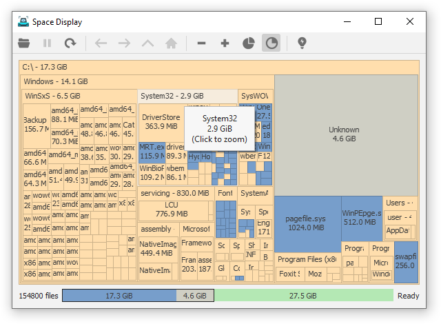
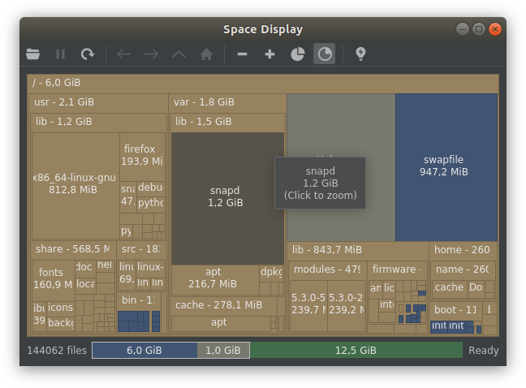

Space Display
-------------

Almost cross-platform (no macOS support yet) way to analyze used disk space.

Screenshots
-----------

Light theme in Windows 10:  

Dark theme in Manjaro KDE:  

Basic usage
-----------

Run the binary `spacedisplay`. Right click on empty space (or click new icon) and select desired device.
Wait until scan is finished.
Each rectangle represents file (if it is blue) or directory (if it is yellow).
If rectangle is big enough, it will display file/directory name and its size. You can navigate by clicking
on any directory and by using navigation buttons in toolbar. From directory context menu you can
rescan it or open in default file manager. You can also show files in file manager from their context menu.

Controls
--------
Mouse wheel - increase/decrease depth of displayed structure  
Left mouse click - go to clicked directory  
Right mouse click - context menu  
F5 - rescan current view  
Alt+Left and Alt+Right (or mouse buttons back and forward) - navigate back/forward  
Ctrl+N - start a new scan

Performance
----------

SpaceDisplay is written with speed in mind so it should be quite fast (even faster than default file manager).
First scan might seem slow but it is mainly because OS is not that fast accessing information about files.
It is also much slower to scan an HDD than an SSD.
After the first run OS caches information about files in memory so subsequent scans are much faster.
It might take minutes for first scan of HDD but after that new scan will take just a few seconds.
Here are some test results with time in seconds that takes to fully scan partition that I made on my PC.

|   Platform  | Files | SpaceDisplay | File Manager |
|:-----------:|-------|:------------:|:------------:|
|  Windows 10 | 389K  |     2.4s     |      24s     |
| Manjaro KDE | 300K  |     0.8s     |     2.3s     |

In tests above default file manager is Explorer in Windows and Dolphin in Manjaro KDE.

SpaceDisplay is also lightweight in terms of memory usage.  
To scan 500k files it uses about 84MB of RAM in 64bit version and 67MB in 32bit version.
Numbers are measured in Windows 10 while scanning drive C:\ with 505k files.

Requirements
------------

To build from source you will need `qt5`, `python3` and `cmake`.

Supported compilers are `gcc` (Linux and MinGW) and `msvc`
(tested with Visual Studio 2015 Community Edition)

Linux is covered in [Linux](#Linux) section.
Windows is covered in [Windows](#Windows) section.

Building from source
--------------------

### Linux

Since distributions have their own repositories, check them for following packages (for qt5 names could be different):
~~~
gcc
make
cmake
qt5-base
qt5-svg
~~~
For example, if you're using Arch/Manjaro, first you should update existing packages via `pacman -Syu`.
Then install/update required packages:
~~~
pacman --needed -S gcc make cmake qt5-base qt5-svg
~~~
`gcc` and `make` should be already installed in any Linux distribution.
So you will need to install only `cmake`, `qt5-base` and `qt5-svg` (if they are not installed already).
After installing all required packages you can just build executable using helper file `build-lnx.sh`:
~~~
chmod +x build-lnx.sh
./build-lnx.sh
~~~
Just make sure you are at the project root directory.
If it builds successfully, output will be stored in `bin` directory.

### Windows

##### MinGW

1. Install [MSYS2](https://www.msys2.org) somewhere, prefer to install it to `C:\msys64` to avoid any problems
2. Launch MSYS2 console: `C:\msysXX\msys2.exe` (assuming MSYS2 was installed to `C:\msysXX`).
3. Update system by executing `pacman -Syu`
(run this command several times until it will display that there is nothing to update)
4. The compilers are not installed by default, so install them and required packages:
~~~
pacman -S mingw-w64-x86_64-gcc mingw-w64-x86_64-make mingw-w64-x86_64-cmake mingw-w64-x86_64-qt5
~~~
Now you should be able to build application with mingw64. Launch mingw64 console:
`C:\msysXX\mingw64.exe` (assuming MSYS2 was installed to `C:\msysXX`).

After that just execute `build-win.sh` helper script while located in project directory to build the app.
If it builds successfully, output will be stored in `bin` directory. It can be run directly from mingw console.
But if you launch it from explorer, you'll need to put required dll's to bin folder. Here's the list:
~~~
libbz2-1.dll
libdouble-conversion.dll
libfreetype-6.dll
libgcc_s_seh-1.dll
libglib-2.0-0.dll
libgraphite2.dll
libharfbuzz-0.dll
libiconv-2.dll
libicudt65.dll
libicuin65.dll
libicuuc65.dll
libintl-8.dll
libpcre-1.dll
libpcre2-16-0.dll
libpng16-16.dll
libstdc++-6.dll
libwinpthread-1.dll
libzstd.dll
Qt5Core.dll
Qt5Gui.dll
Qt5Svg.dll
Qt5Widgets.dll
zlib1.dll
~~~
You also need to copy required qt5 plugins from `C:\msysXX\mingw64\share\qt5\plugins` (assuming MSYS2 was installed to `C:\msysXX`):
~~~
platforms/qwindows.dll
styles/qwindowsvistastyle.dll
~~~
After that you can launch `spacedisplay.exe` from explorer.

##### Visual Studio 

_You will need to download `qt5` and provide path to visual studio prebuilt binaries when running Cmake.
If you use sample build scripts, you'll have to edit the part "-DQT_WIN_PATH=<path_to_qt>" so it points to your
installation_

1. Download Cmake 3.13 or higher (for example, to `C:\cmake\cmake-3.13.5-win32-x86`), latest version recommended
and write path to its cmake.exe in `cmake_win_path.txt` (see `cmake_win_path.example.txt` for an example)
2. Start command prompt or PowerShell in project directory (using Shift + Right Mouse Click) and run `build-win-msvcXX_x64.bat` where XX is
version of installed Visual Studio. If it's not 14 or 15, use existing `build-win-msvc14_x64.bat` as an example
3. Builded binary should be in bin folder, you'll need to put following Qt5 dll's to the bin folder:
~~~
Qt5Core.dll
Qt5Gui.dll
Qt5Svg.dll
Qt5Widgets.dll
platforms/qwindows.dll
styles/qwindowsvistastyle.dll
~~~

Acknowledgements
----------------
Space Display uses following open source software:

Qt5, LGPLv3, http://www.qt.io

resource-builder, MIT license, https://github.com/funbiscuit/resource-builder

stb, public domain, https://github.com/nothings/stb

portable file dialogs, WTFPL, https://github.com/samhocevar/portable-file-dialogs
